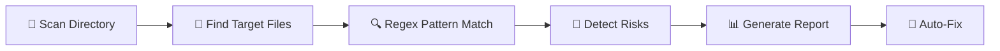

# 🛡️ KeySentry v1.0

<div align="center">


**Zero-Dependency AI Security Tool • Instant Scan • Protect Your API Wallet**

[](https://www.python.org/)
[]()
[]()

---

*Stop burning money on leaked API keys. Scan in seconds. Sleep peacefully.* 💰

</div>

## 🎯 What is KeySentry?

KeySentry is a **lightning-fast**, **zero-dependency** security scanner that detects leaked API keys in your codebase before attackers drain your wallet.

### ⚡ Three Core Values

| Feature | Benefit |
|---------|---------|
| 🪶 **Zero Dependencies** | No `pip install` needed. Just Python and go! |
| ⚡ **Instant Scan** | Scan entire projects in milliseconds |
| 💰 **Protect Your Wallet** | Prevent costly API key theft & abuse |

## 🚀 Quick Start

### Installation

**Nothing to install!** Just clone and run:

```bash
git clone https://github.com/yourusername/keysentry.git
cd keysentry
```

### Usage

```bash
# Scan current directory
python sentry.py

# Scan specific directory
python sentry.py /path/to/your/project
```

That's it! **Zero configuration. Zero dependencies. Instant results.** ⚡

## 🔍 What Can It Detect?

KeySentry identifies API keys from **major AI platforms**:

### 🌍 Global Platforms

| Platform | Key Format | Status |
|----------|------------|--------|
| 🤖 **OpenAI** (GPT) | `sk-...` | ✅ Supported |
| 🧠 **Anthropic** (Claude) | `sk-ant-...` | ✅ Supported |
| 💎 **Google** (Gemini) | `AIza...` | ✅ Supported |
| ⚡ **Groq** (Ultra-Fast) | `gsk_...` | ✅ Supported |
| 🚀 **xAI** (Grok) | `xai-...` | ✅ Supported |
| 🌬️ **Mistral AI** | `mistral-...` | ✅ Supported |

### 🇨🇳 Chinese Platforms

| Platform | Status |
|----------|--------|
| 🔮 **DeepSeek** (深度求索) | ✅ Supported |
| 📱 **Xiaomi MiMo** (小米) | ✅ Supported |
| 🌙 **Moonshot** (Kimi) | ✅ Supported |
| 🧪 **Zhipu AI** (智谱清言) | ✅ Supported |
| ☁️ **Tongyi Qianwen** (阿里云) | ✅ Supported |

## 📊 Sample Output

```
======================================================================
  🛡️  KeySentry - API密钥安全扫描工具 v1.0
======================================================================
  📁 扫描目录: /your/project
======================================================================

【 扫描进度 】
  📂 已扫描文件数: 42

【🚨 危险】
  🆘 发现 2 处 API 密钥泄露！
  ⚠️  您的密钥可能已经被盗用，请立即处理！

  💀 风险 #1
     📄 文件: config.py
     📍 第 15 行
     🔑 密钥: sk-abc...xyz

【🛠️ 救命药方】
  👉 立即点击下方链接进入平台撤销密钥！

【🔗 救命传送门】
  🌍 OpenAI: https://platform.openai.com/api-keys
  🔮 DeepSeek: https://platform.deepseek.com/api_keys
```

## 🛡️ Security Features

### 🔐 Smart .gitignore Detection

KeySentry automatically checks if your `.gitignore` properly protects sensitive files:

- ✅ `.env` files
- ✅ Virtual environments (`.venv/`, `venv/`)
- ✅ IDE configurations (`.vscode/`, `.idea/`)
- ✅ Python cache (`__pycache__/`)

### 🔧 One-Click Auto-Fix

Found issues? KeySentry can **automatically fix** your `.gitignore`:

```
【🔧 一键修复模式】
  是否需要哨兵自动为您创建 .gitignore 并屏蔽风险文件？
  👉 输入 Y 即可一键修复
```

## 🎓 How It Works



1. **📂 Recursive Scan** - Traverses all directories
2. **📄 Smart Filtering** - Only scans relevant file types (`.py`, `.js`, `.env`, etc.)
3. **🔍 Pattern Matching** - Uses regex to detect API key patterns
4. **🚨 Risk Analysis** - Identifies platform & severity
5. **📊 Visual Report** - Clear, actionable security report
6. **🔧 Auto-Fix** - One-click `.gitignore` repair

## 💡 Why KeySentry?

### ❌ The Problem

- API keys leaked in code = **$$$ burned**
- Attackers scan GitHub 24/7 for exposed keys
- Average breach cost: **$100-1000+** per leaked key

### ✅ The Solution

| Traditional Tools | KeySentry |
|-------------------|-----------|
| 🐌 Require `pip install` | ⚡ **Zero dependencies** |
| 🔧 Complex configuration | 🎯 **Zero configuration** |
| 📚 Steep learning curve | 🚀 **Instant results** |
| 💰 Often paid | 🆓 **100% Free** |

## 📁 Supported File Types

KeySentry scans these file extensions:

```
.py .js .ts .env .json .yaml .yml .toml .cfg .ini .conf
```

## 🚫 Ignored Directories

Automatically skips these to save time:

```
node_modules  __pycache__  .git  venv  .venv
dist  build  .idea  .vscode
```

## 🤝 Contributing

Contributions are welcome! Please feel free to submit a Pull Request.

## 📄 License

This project is licensed under the MIT License - see the [LICENSE](LICENSE) file for details.

## 🙏 Acknowledgments

- Built with ❤️ for developers who care about security
- Inspired by the need to protect API wallets worldwide

---

<div align="center">

**🛡️ KeySentry - Your API Wallet's Guardian**

*Zero dependencies. Zero worries. Zero cost.*

[⭐ Star on GitHub](https://github.com/yourusername/keysentry) • [🐛 Report Bug](https://github.com/yourusername/keysentry/issues) • [💡 Request Feature](https://github.com/yourusername/keysentry/issues)

</div>